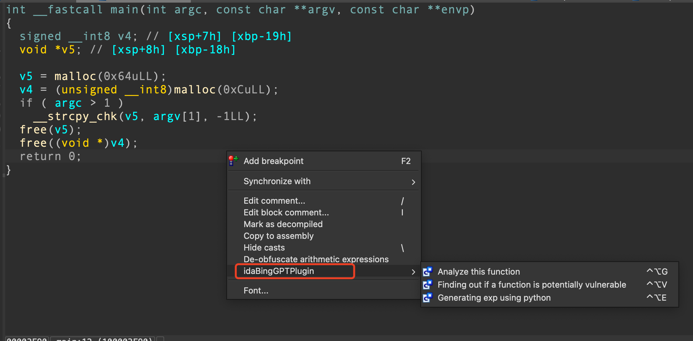

<!--
 * @Description: Editor's info in the top of the file
 * @Author: p1ay8y3ar
 * @Date: 2023-11-23 18:50:30
 * @LastEditor: p1ay8y3ar
 * @LastEditTime: 2023-11-23 19:14:27
 * @Email: p1ay8y3ar@gmail.com
-->
# idaBingGPTPlugin 
Use the free Microsoft bing's gpt with ida pro, to perform free analyzes!

## Before use 
- clone this repo, move `idaBingGPTPlugin.py` and `ibgp_cookies.json` to your ida plugins folder
- open `bing.com/chat` in your Edge browser 
- install browser extension [Cookie-Editor](https://microsoftedge.microsoft.com/addons/detail/cookieeditor/neaplmfkghagebokkhpjpoebhdledlfi)
- login your account 
- press Cookie-Editor button and press **Export** button to export your cookies
- paste the cookies to `ibgp_cookies.json`
## How to use
This plugin works only on F5 pseudocode window.

Press right mouse you will see the tab **idaBingGPTPlugin**.

## Test on
- idapro 8.4  macOS arm64 version
- idapro 7.6  macOS arm64 version

## Thanks to 
[VulChatGPT](https://github.com/ke0z/VulChatGPT)